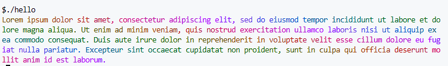

# lolz
lolcat wrapper for printf


# Usage

```c
  // use it like you would printf
  lolz("%d", 2);
  lolz("Hello!");
```

# Example

[hello.c](./examples/hello.c)

```sh
gcc -I. examples/hello.c -o hello
./hello
```


